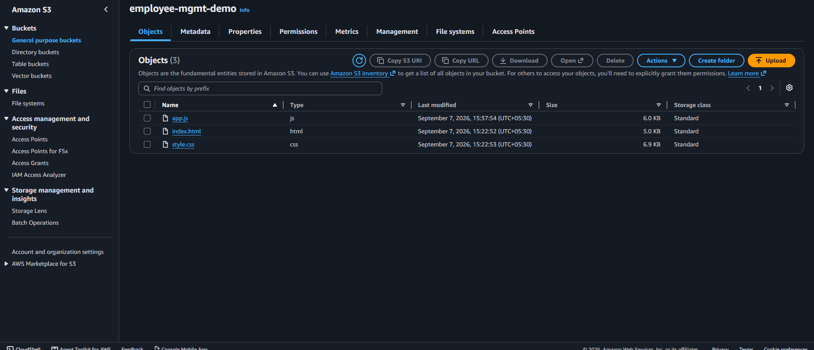
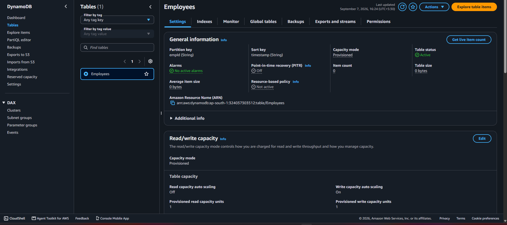
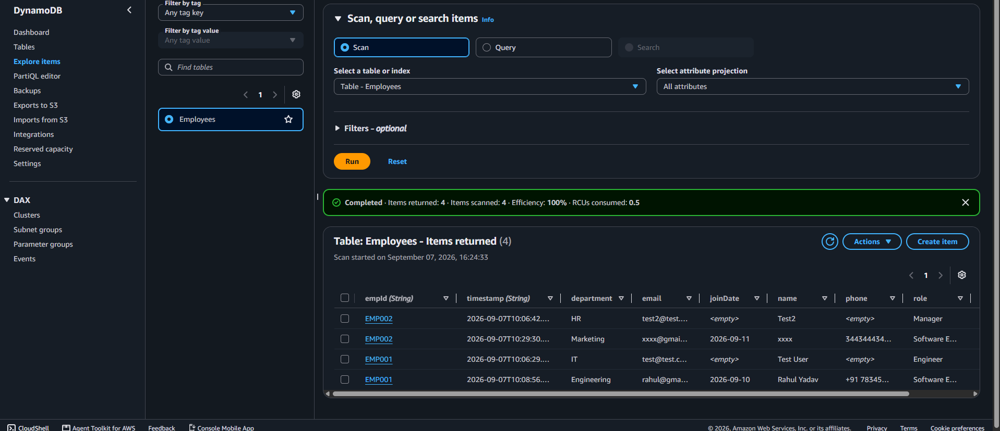
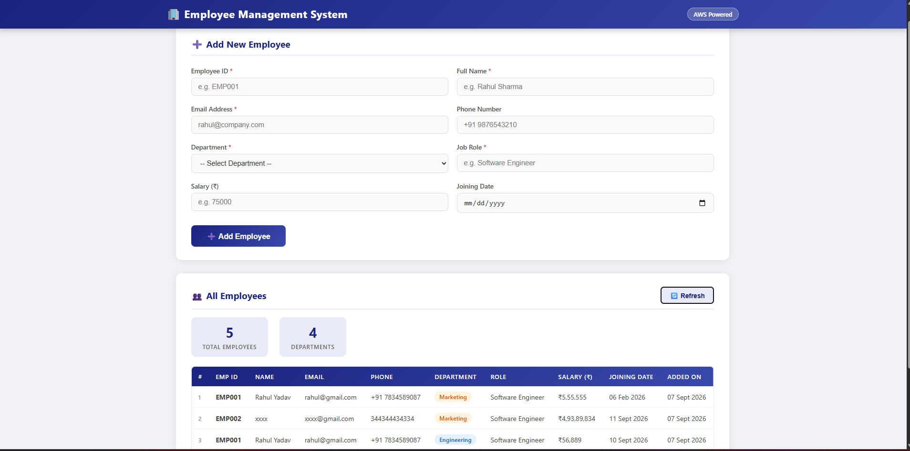
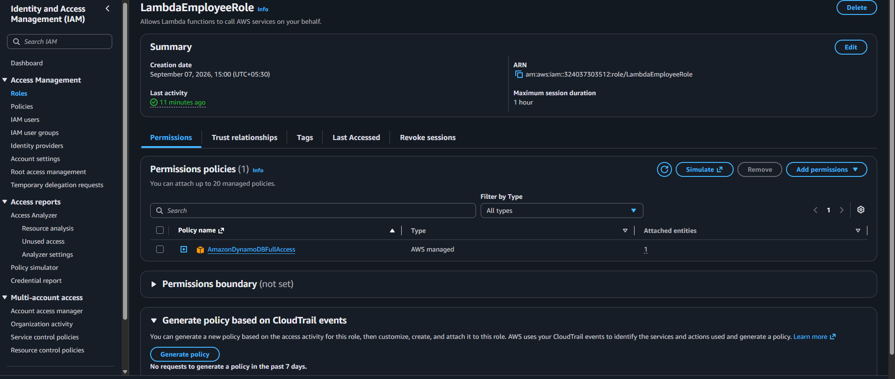
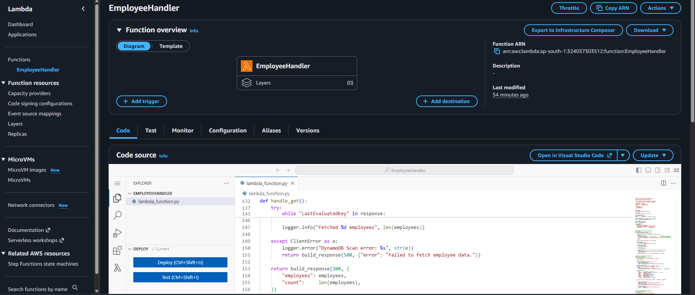
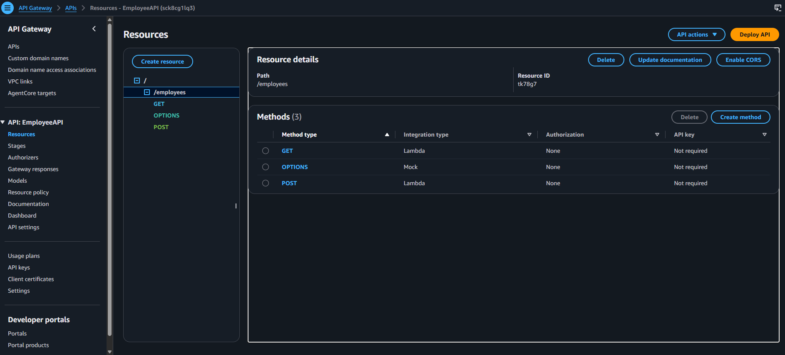

# 🏢 Employee Management System
### Serverless Web App on AWS — S3 + API Gateway + Lambda + DynamoDB


A fully serverless employee data management system hosted on AWS.  
Users can **add employees** and **view all employees** in real time — no backend server needed.

---

## 🖥️ Live Demo

> Website URL (S3 Static Hosting):  
> `http://employee-mgmt-demo.s3-website.ap-south-1.amazonaws.com`

---

## 📸 Screenshots

### 1. Live Website — Employee Form + Table (5 Employees, 4 Departments)


### 2. API Gateway — EmployeeAPI /employees Resource (GET, POST, OPTIONS)


### 3. Lambda Function — EmployeeHandler Code (Python)


### 4. S3 Bucket — employee-mgmt-demo (app.js, index.html, style.css)


### 5. IAM Role — LambdaEmployeeRole with AmazonDynamoDBFullAccess


### 6. DynamoDB — Explore Items (Scan returns 4 records)


### 7. DynamoDB — Employees Table Settings


---

## 🏗️ Architecture

```
┌──────────────┐     opens      ┌─────────────────────────────┐
│   Browser    │ ────────────▶  │   S3 Static Website          │
│              │                │   index.html / style.css     │
│              │                │   app.js                     │
└──────┬───────┘                └─────────────────────────────┘
       │
       │  POST /employees  (Add employee)
       │  GET  /employees  (Fetch all employees)
       ▼
┌─────────────────────────────┐
│      API Gateway            │
│   REST API  —  /employees   │
│   Methods: GET, POST        │
└──────────────┬──────────────┘
               │ trigger
               ▼
┌─────────────────────────────┐
│      AWS Lambda             │
│   EmployeeHandler           │
│   Runtime: Python 3.12      │
│                             │
│   POST → put_item()         │
│   GET  → scan()             │
└──────────────┬──────────────┘
               │ PutItem / Scan
               ▼
┌─────────────────────────────┐
│      DynamoDB               │
│   Table: Employees          │
│   PK: empId  SK: timestamp  │
└─────────────────────────────┘
```

### AWS Services Used

| Service | Purpose |
|---|---|
| S3 | Host static HTML, CSS, JS files |
| API Gateway | Public HTTP endpoints (GET + POST) |
| Lambda | Business logic — insert & fetch employees |
| DynamoDB | NoSQL database — store employee records |
| IAM | Lambda execution role with DynamoDB permissions |
| CloudWatch | Lambda logs and monitoring |

---

## 📁 Project Structure

```
static-website-dynamodb/
├── website/
│   ├── index.html          ← Employee form + display table
│   ├── style.css           ← Professional UI styling
│   └── app.js              ← POST (add) + GET (fetch) API calls
├── lambda/
│   └── lambda_function.py  ← Lambda handler (routes POST + GET)
├── screenshots/            ← Project screenshots for README
├── .gitignore
├── bucket-policy.json      ← S3 public read policy
├── setup.md                ← Full AWS setup guide
├── ERRORS.md               ← Troubleshooting errors log
└── README.md               ← This file
```

---

## ✨ Features

- ➕ **Add Employee** — Submit form data (Emp ID, Name, Email, Phone, Department, Role, Salary, Joining Date)
- 👥 **View All Employees** — Table auto-loads on page open, with Refresh button
- 📊 **Stats Bar** — Shows total employees and department count
- 🏷️ **Department Badges** — Color-coded department labels
- ✅ **Success / Error Toasts** — Instant feedback on form submit
- 📱 **Responsive Design** — Works on desktop and mobile
- ☁️ **100% Serverless** — No server to manage

---

## 🚀 Setup & Deployment

See the full step-by-step guide in **[setup.md](setup.md)**

### Quick Summary

1. **DynamoDB** — Create table `Employees` (PK: `empId`, SK: `timestamp`)
2. **IAM** — Create role `LambdaEmployeeRole` with `dynamodb:PutItem` + `dynamodb:Scan`
3. **Lambda** — Create function `EmployeeHandler` (Python 3.12), deploy `lambda_function.py`
4. **API Gateway** — Create REST API, add `/employees` resource with GET + POST methods (enable Lambda Proxy integration + CORS), deploy to `prod` stage
5. **Update app.js** — Replace `API_ENDPOINT` with your API Gateway URL
6. **S3** — Create bucket, enable static website hosting, upload `website/` files

---

## 🔌 API Reference

| Method | Endpoint | Description |
|---|---|---|
| `POST` | `/employees` | Add a new employee |
| `GET` | `/employees` | Fetch all employees |

**POST — Request Body:**
```json
{
  "empId":      "EMP001",
  "name":       "Rahul Sharma",
  "email":      "rahul@company.com",
  "phone":      "+91 9876543210",
  "department": "Engineering",
  "role":       "Software Engineer",
  "salary":     "75000",
  "joinDate":   "2026-01-15"
}
```

**GET — Response:**
```json
{
  "employees": [
    {
      "empId": "EMP001",
      "name": "Rahul Sharma",
      "email": "rahul@company.com",
      "department": "Engineering",
      "role": "Software Engineer",
      "salary": "75000",
      "joinDate": "2026-01-15",
      "timestamp": "2026-09-07T10:06:43+00:00"
    }
  ],
  "count": 1
}
```

---

## 🐛 Troubleshooting

See **[ERRORS.md](ERRORS.md)** for a full list of errors encountered and their fixes.

### Common Issues

| Error | Fix |
|---|---|
| ❌ Network error on submit | Check `API_ENDPOINT` in `app.js` has correct URL + `/employees` |
| CORS blocked by browser | Enable CORS in API Gateway → redeploy |
| Method '' not allowed | Enable Lambda Proxy integration on GET + POST methods |
| 403 on S3 website | Disable Block Public Access + add bucket policy |
| Data not saving | Check Lambda IAM role has `dynamodb:PutItem` permission |

---

## 🧪 Test the API (PowerShell)

```powershell
# GET — fetch all employees
Invoke-WebRequest `
  -Uri "https://YOUR_API_ID.execute-api.ap-south-1.amazonaws.com/prod/employees" `
  -Method GET -UseBasicParsing | Select-Object -ExpandProperty Content

# POST — add an employee
$body = '{"empId":"EMP001","name":"Rahul Sharma","email":"rahul@company.com","department":"Engineering","role":"Software Engineer"}'
Invoke-WebRequest `
  -Uri "https://YOUR_API_ID.execute-api.ap-south-1.amazonaws.com/prod/employees" `
  -Method POST -Body $body -ContentType "application/json" -UseBasicParsing | Select-Object -ExpandProperty Content
```

---

## 🛠️ Tech Stack

| Layer | Technology |
|---|---|
| Frontend | HTML5, CSS3, Vanilla JavaScript |
| Hosting | AWS S3 Static Website |
| API | AWS API Gateway (REST) |
| Backend | AWS Lambda (Python 3.12) |
| Database | AWS DynamoDB (NoSQL) |
| IAM | AWS IAM Roles & Policies |
| Monitoring | AWS CloudWatch Logs |

---

## 📝 License

This project is for educational purposes — AWS DevOps learning.

---

> Built with ☁️ on AWS | Serverless Architecture Demo
